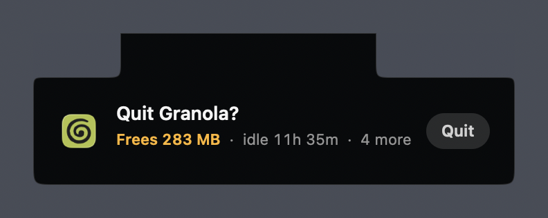
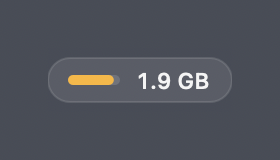
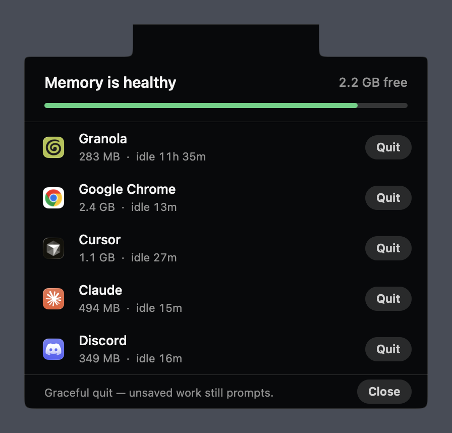
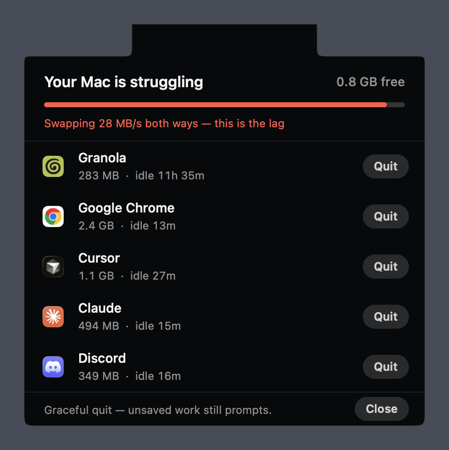

<h1 align="center">Headroom</h1>

<p align="center">
  <strong>macOS tells you you're out of memory when it's already too late to act.<br>Headroom tells you while your Mac is still responsive.</strong>
</p>

<p align="center">
  <a href="#install">Install</a> ·
  <a href="#how-it-works">How it works</a> ·
  <a href="#privacy">Privacy</a> ·
  <a href="CONTRIBUTING.md">Contributing</a>
</p>

<p align="center">
  
  
  
  <a href="LICENSE"></a>
</p>

<p align="center">
  
</p>

---

By the time macOS shows you "Your system has run out of application memory", it is
swapping so hard that the force-quit dialog itself is unusable. People end up holding the
power button.

Headroom watches the signals that actually predict that moment, learns which apps you
haven't touched, and asks you to close one **while you can still click things**.

It never quits anything on its own.

## Install

Requires **macOS 14+** and the Xcode Command Line Tools. Full Xcode is not needed.

```sh
xcode-select --install          # if you don't already have them
git clone https://github.com/VasPug/Headroom-Memory-Management.git
cd Headroom-Memory-Management
./build-app.sh --install
```

This builds the app, installs it to `/Applications`, starts it, and registers a LaunchAgent
so it returns at login. On first run it opens once so you can find it.

**Build without installing:**

```sh
./build-app.sh                  # produces build/Headroom.app
swift run HeadroomTests         # run the test suite
swift run HeadroomTests --state # print what your Mac looks like right now
```

**Uninstall — removes the app, the LaunchAgent, preferences, and all learned data:**

```sh
./build-app.sh --uninstall
```

> Headroom is unsigned and unnotarized, because it is built from source on your own
> machine. It is not distributed as a binary, so there is no Gatekeeper prompt.

## Using it

<p align="center">
  
  <br>
  <em>Ambient by default: a pill beside the notch. Click it for the list.</em>
</p>

|  |  |
|---|---|
| **Click** the pill | open the ranked list; it stays until you dismiss it |
| **Close**, `Esc`, or click away | dismiss |
| **Quit** on a row | graceful quit — unsaved-work prompts still appear |
| **Keep** (on row hover) | never suggest that app again |
| **⌘-drag** the HUD | move the pill anywhere along the top of the screen |
| **Right-click** | rescan, flip sides, erase learned usage, quit |

<table align="center">
<tr>
<td width="50%"></td>
<td width="50%"></td>
</tr>
<tr>
<td align="center"><em><strong>86% of memory in use — and completely fine.</strong><br>The meter is full because memory is full. It's green because nothing is actually wrong.</em></td>
<td align="center"><em><strong>The same meter, genuinely in trouble.</strong><br>Colour changed, and it names the mechanism rather than a scary number.</em></td>
</tr>
</table>

## How it works

### It does not measure "memory used"

macOS is *designed* to use nearly all of your RAM. A Mac sitting at 90% with nothing moving
is working exactly as intended, and most memory tools cry wolf at it. Headroom ignores that
number for severity and watches what actually degrades the machine:

| Signal | Why it matters |
|---|---|
| **Thrash rate** — `min(swapout/s, swapin/s)` | Pages leaving and coming straight back is what makes a Mac lag. |
| **Swapout rate** | Sustained writes to swap mean memory is being exhausted *right now*. |
| **Free boot-disk space** | Swap can only grow into it. Running out is the real precondition for "out of application memory". |
| **`kern.memorystatus_vm_pressure_level`** | The kernel's own verdict, used as a floor — Headroom is never quieter than macOS. |

**Swap totals are deliberately ignored.** Swap used is a high-water mark: it climbs and
essentially never falls, so 8 GB of swap says what has happened since boot, not what is
happening now.

The meter's **length** shows how full memory is. Its **colour** shows whether that is a
problem. Those are different questions, and conflating them is why memory tools feel like
they are always shouting.

### It learns which apps you don't use

Headroom notes when each app was last frontmost and persists it. Ranking is
**memory × idle time**, so a 2 GB app you haven't opened since Tuesday outranks a 3 GB app
you were in a minute ago. Memory is rolled up across the whole process tree, so Chrome
reports its real footprint including every renderer, not the parent's 300 MB.

**It will never suggest:** the app you're looking at, anything used in the last five
minutes, anything burning CPU (so it won't kill your build), Finder/Dock/WindowServer,
processes you don't own, or anything you marked **Keep**.

### It interrupts only when things get worse

Every escalation alerts immediately — no cooldown, no rate limit. It stays quiet while
nothing changes, and re-arms after a sustained calm period. Alerts name the mechanism
("Swapping 28 MB/s both ways — this is the lag") rather than a number that sounds scary.

## Privacy

Headroom records exactly one thing: **a timestamp of when each app was last frontmost.**

- Stored at `~/Library/Application Support/Headroom/usage.json`
- **There is no network code in this project.** Nothing is uploaded, ever.
- No Accessibility or Screen Recording permission is requested, so it *cannot* read your
  screen or your keystrokes — only which app is in front, and what `ps` reports.
- **Erase learned usage** in the right-click menu wipes it. `--uninstall` removes it too.

## Project layout

```
Sources/
  HeadroomCore/           pure logic, no UI — this is where the tests live
    ProcessScanner        parses ps, folds subtrees into their root process
    Pressure              judges thrash rate, disk headroom, kernel verdict
    PressureSampler       live VM counters (stateful: rates need a baseline)
    Ranker                what's worth quitting: big, cold, and idle
    NudgePolicy           when it is allowed to interrupt you
    UsageTracker          per-app last-used times, persisted
    CandidateBuilder      joins processes to apps; performs the quit
  Headroom/               the AppKit HUD
    NotchContentView      drawn from one path so it hangs off the notch
    HUDController         pill → notification → panel state machine
  HeadroomTests/          runnable test suite (see CONTRIBUTING.md)
```

## Contributing

Issues and pull requests are welcome — see **[CONTRIBUTING.md](CONTRIBUTING.md)**.

Good first issues: mirroring notifications to the active display on multi-monitor setups,
an alert history so thresholds can be tuned against real usage, and a Homebrew cask.

## License

[MIT](LICENSE).
